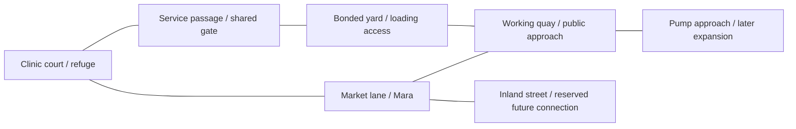

# Funstra development plan — A Port That Needs You

Creative direction approved by the owner, 8 September 2026; revised to prioritize projectile combat, enemy groups and criminal relationships. [Epic #26](https://github.com/Kaliffen/Funstra/issues/26).
**Direction approved; future gameplay is not implemented or accepted as a playable release.** This is the single maintained roadmap and spatial design contract. GitHub issues own execution status. [VISION.md](VISION.md) owns the game promise; [WORLD.md](WORLD.md) owns setting facts. Start at [README.md](README.md) for the published game and documentation map.

## The decision

Preserve readable, stylized isometric forms while following the owner's 8 September darker direction: soot, saltstone, rust, severe light and scarce warm refuge. Rebuild Old Port as a place with useful spaces, owners, entrances, work and competing routes. Expand it in connected, distinct pieces. The player should learn a street, judge people through their conduct, exploit its opportunities, depend on its people and eventually decide what it becomes.

**Identity bridge ([#41](https://github.com/Kaliffen/Funstra/issues/41)):** Demo06 includes named residents' perceived danger, distinct priorities, finite aid and remembered encounters using shared movement and resource rules. The visual pass follows the updated VISION direction; older warm-palette notes below describe prior accepted work. Owner visual acceptance remains separate. The bridge supports the crew operation.

Current release work is Nobody Gets Home Alone 0.6.0, following Pressure and Escape 0.4.2 and the local Demo05 acquisition/supply bridge. It adds three selectable people, finite equipment and aid, physical rescue, remembered abandonment, one contested dock component, an auxiliary repair partnership and finite rifle opposition. Four original guided reviews score Game now 5.3–5.7/10. Their deductions expose the remaining gap between working mechanisms and a sustained life in the port. [#42](https://github.com/Kaliffen/Funstra/issues/42) tracks useful practice, [#43](https://github.com/Kaliffen/Funstra/issues/43) partner equipment clarity and an ordinary crew livelihood route, and [#30](https://github.com/Kaliffen/Funstra/issues/30) lasting commitments and a foothold. [Validation and delivery receipts](Evidence/VALIDATION.md), [play manual](NOBODY-GETS-HOME-ALONE.md) and [dossier](Docs/funstra-review-dossier-demo06.html) identify actual evidence and publication; human acceptance is separate. Future capabilities below are not claimed implemented.

## What the feedback changes

| Input | CD disposition | Work |
|---|---|---|
| Owner/MVP feedback: good art, shallow and repetitive environment; needs scale and interactions | Accept. Spatial design becomes a core gameplay deliverable. Increasing ground area or prop count alone is insufficient. | Demo 04 and the spatial contract below |
| Priya/Nell: the refuge matters in prose more than in the world | Accept. Make recovery, shared space and eventually patient visits visible. | Existing [#22](https://github.com/Kaliffen/Funstra/issues/22), Demo 07; interiors deferred behind combat |
| Dag: finite economy is coherent, sustained traffic interaction remains uncertain | Keep the conserved rules, extend them to bounded imports and physical delivery; test obstruction before relying on travel for supply. | Existing [#23](https://github.com/Kaliffen/Funstra/issues/23), Demos 04–05 |
| Marcus: coverage limits and weak hardware evidence | Profile growth on the available 4090. Record actual CPU/GPU/memory costs; do not invent low-end support. | Existing [#21](https://github.com/Kaliffen/Funstra/issues/21), every release |
| Four Demo 03 scores of 8/10 | Preserve as guided-build judgments. They do not settle open-ended enjoyment or the long-term vision. | Every release has new identified-build reviews |
| Demo 03 reserve-threshold and standing screenshots | Already resolved in the publication addendum and closed #20. | Do not reopen as new work |
| Additional local field critique | Useful diagnosis of mission-shaped space and HUD density; source/still inspection has narrower coverage than live play. | Contextual HUD, physical work, autonomous baseline |
| Stop all development until unrestricted play or replace the entire art style | Decline. Continue the accepted guided-build process and seek owner/new-user reactions at published demos. Art should gain structure and purpose. | No art replacement programme or invented review requirement |

The [Demo 03 dossier](Docs/funstra-review-dossier-demo03.html) and original reviews remain historical records. The additional `Docs/funstra-field-review.html` is user-supplied, untracked input, not a new four-person dossier. Its older test counts and suggestion that no human has played are not adopted: the owner has already reported playing. This table is a new planning response, not a revision of anyone's score.

## Long-term target and the Demo 09 proof

**Become someone Old Port depends on.** The full game aspires to a damaged city where independently acting organizations need goods, labor, treatment and access; the player can survive outside them, join them or build one that can endure setbacks. The six-release arc proves this locally through a criminal sandbox: dangerous outings, illegal weapons, credible enemy groups, dealers, bosses, helpful contacts, trust, betrayal and investigators. Medicine and shelter give that life consequences; running a clinic is one path, not the dominant game identity.

By Demo 09, a player can begin dependent on shelter and a supplier, recruit two people, establish a staffed foothold and influence a dispute about the pump approach and relief access. At least three distinct connected subareas support the same resource and movement rules. Two local institutions respond to what they know and can afford.

The acceptance scenario is 60–90 minutes, with no required Mara job acceptance. Compare cooperation, illicit appropriation/betrayal and deliberate non-intervention from comparable starting states, including weapon acquisition, a coordinated fight and the resulting investigation. These must leave different visible staffing, access and treatment outcomes. Lose a route or refuge and recover through surviving relationships. After a local settlement, continue for three service cycles under the new obligations. Also demonstrate a viable independent livelihood without owning a building.

This is the approved direction; playable delivery remains for the product owner to judge. It is not a promise of six calendar weeks, a finished game, or a mandatory path from poverty to government.

## Six cumulative releases

Owner approved the integrated Demo04 candidate on 8 September 2026 and requested an escalating response to attacks on residents. Civilians remain attackable. Immediate enforcement follows reported sightings of the gunman; breaking sight creates a search, not hidden-position tracking. [#39](https://github.com/Kaliffen/Funstra/issues/39), **Police Response 0.4.1**, is published. The owner approved **Pressure and Escape 0.4.2**, [#40](https://github.com/Kaliffen/Funstra/issues/40), as the next iteration before the remaining Demo05 acquisition/supply work: sustained nine-officer combat, readable ammunition and CONTACT/SEARCH feedback, escape, crowded deployment and contextual recovery text.

The escalation is cumulative:

- **Published Demo05 foundation / active pressure follow-up:** all living patrols share reported contact, return finite projectile pistol fire after identified violence, and receive two visible truck deliveries of three officers (nine police maximum). The active iteration must demonstrate collective combat and escape with readable pause/search feedback before scaling up.
- **Demo06:** introduce rifle-equipped police response squads alongside the rifle and group coordination work. Trucks carry actual finite personnel; covering fire and flanking use communicated sightings. This extends the enemy response while the controllable crew remains three people.
- **Demo08:** sustained extreme violence can bring Compact army trucks and **at least 30 soldiers simultaneously at maximum pressure** (initial bounded target: 32), with rifles and physical grenades. Coordinating squads cover, flank and force movement; the player should be overwhelmed by sustained exposure. Grenades have visible travel, fuse warnings, cover/obstruction and shared damage rules. Deployment, firing, navigation and frame time must be verified at full strength. No infinite personnel spawning or tracking a concealed player through walls.
- **Demo09:** integrate the full escalation with witnesses, investigations, relationships and post-defeat recovery. Escaping immediate pursuit does not erase provable violence.

These are approved design targets, not claims of implemented army, rifles or grenades. The four guided Pressure and Escape reviews (each 8/10), CD integration and verified publication are complete; human acceptance of each new iteration remains separate.

| Release | Player outcome | Ticket |
|---|---|---|
| 04 — Streets Worth Fighting For | Movement, aiming and a dangerous street encounter feel good before the game grows further. | [#27](https://github.com/Kaliffen/Funstra/issues/27) |
| 05 — The Price of a Gun | Acquiring and firing an illegal weapon is a consequential choice involving other people. | [#28](https://github.com/Kaliffen/Funstra/issues/28) |
| 06 — Nobody Gets Home Alone | A capable crew can take on a dangerous site and bring its people home. | [#29](https://github.com/Kaliffen/Funstra/issues/29) |
| 07 — A Place of Our Own | We can rely on people, betray them, and risk losing something we built together. | [#30](https://github.com/Kaliffen/Funstra/issues/30) |
| 08 — The Price of Order | Investigators and institutions react to what they can prove; relationships give us ways to respond. | [#31](https://github.com/Kaliffen/Funstra/issues/31) |
| 09 — A Port That Needs You | A small criminal sandbox sustains combat, relationships and consequences after a local settlement. | [#32](https://github.com/Kaliffen/Funstra/issues/32) |

Dependency order: physical feel and combat → illegal weapons and supply → crew and dangerous sites → trust and foothold → investigation → integrated criminal sandbox. Each release depends on the preceding tested foundation. Interiors are scheduled for Demo07; combat takes priority.

### Demo 04 — Streets Worth Fighting For

**Outcome:** Movement, aiming and a dangerous street encounter feel good before the game grows further.

Recompose the clinic/market/quay loop with an adjoining yard, public and gated service approaches, readable cover and reliable camera/selection. Introduce simulated projectile combat for player and enemies: pistol and shotgun, finite magazines, interruptible reloads, distinct handling and impacts. A small enemy group can hold an approach, reposition under communicated knowledge and retreat when disadvantaged. Preserve existing clinic/cargo outcomes. #21 profiles the busy route; #23 tests obstruction. The owner inserted #37, **Old Port, a Place**, before this demo can go to review: a radical authored environment redesign, expanded streets/back alleys/courtyards, adapted architectural meshes from the supplied gta-pt project, a church landmark and a usable clinic interior. The clinic must be inside a believable building, with entry, treatment space and a street relationship. Broader property interiors and #22 remain Demo07.

**Acceptance:** Play the same encounter with pistol and shotgun: moving targets, close and longer sightlines, limited ammunition, gate changes and retreat. Shots travel over time and can miss or hit intervening geometry; damage never occurs merely because the trigger was pulled. Shotgun pellets remain separate projectiles. Enemies share observed information with a delay/range rule, lose track honestly, and do not all rush one position. Player and AI respect the same cover and reload/ammunition rules. Traverse two meaningfully different approaches. Record owner judgment of movement/aiming/feedback separately from test passes.

**Validation:** Test swept projectile collision at low/high frame rates, thin/moving obstacles, near-muzzle obstruction, pause, pellet hits, single damage application, ammo/reload interruption and in-flight save/load policy. Inspect motion and audio, not just stills. Run group loss-of-contact, ally incapacity, blocked flank and retreat scenarios. Compare current/new traversal and frame-time profiles. Expand area only after the core street/fight feels convincing.

**Limits:** Two firearms, one bounded small-group encounter and one functional clinic interior. The inserted environment slice may radically replace the repetitive prototype layout and expand its footprint; no arsenal catalogue, full faction AI or infinite city. Scale serves distinct streets, forecourts, housing, a church, a market and a working quay. Supplied low-rise meshes retain warm stylization and get shared rendering/collision; importing more assets alone is insufficient.

**Stop/replan:** If the environment remains clunky or the guns feel interchangeable, refine the proof before increasing map/weapon count. If navigation expansion demands wholesale replacement, reduce to one loop and reversible gate.

The owner also requested restrained Unity lighting/material improvements within #37: warmer dusk light against cooler shade, readable local lamps, differentiated pavement and masonry, and physical signage. Favor shared economical materials and visible improvements in the exported player; avoid a rendering overhaul or effects that obscure combat.

Owner acceptance also requires four selectable, resettable prepared test levels after implementation: movement/obstacles, weapon handling, enemy coordination and a combined encounter. These use production systems with isolated state; normal Old Port play remains part of acceptance. Implementation: #33–36, with the owner-directed environment blocker #37. **No demo review or publication until the integrated environment slice is complete and tested.**

Execution: [#27](https://github.com/Kaliffen/Funstra/issues/27).

### Demo 05 — The Price of a Gun

**Outcome:** Acquiring and firing an illegal weapon is a consequential choice involving other people.

Introduce a named dealer and a first-gun situation with purchase, favor, theft and recovery from defeated enemies as distinct entry paths. Replace the default free pistol for new starts with an authored acquisition opportunity; preserve legitimate existing-save equipment. Guns are illegal without institutional authorization in the setting. Carrying openly, being searched or witnessed use can expose possession; concealed inventory is not omnisciently known. Ammo is expensive relative to ordinary work, sold from bounded stock. Add an SMG after the pistol/shotgun feel gate. Reuse physical delivery rules for one bounded weapons/ammunition route and medicine replenishment.

**Acceptance:** Acquire a gun by two different paths without mandatory Mara job acceptance. Compare negotiation/avoidance, restrained shooting and wasteful fire on net earnings and recovery options. Observe at least three delivery cycles; delay/divert goods and show a dealer/clinic shortage. Exposed illegal possession triggers a local response; unseen concealed possession does not. Every imported, sold, loaded, fired and recovered round has an accounted source/destination. A penniless, disarmed player has a non-suicidal way to earn or acquire access again.

**Validation:** Inventory and money conservation with bounded imports; no duplicated weapon/ammo at pickup, delivery or reload saves. Existing-save migration retains gear; new-start route earns it. Test witness versus non-witness cases and confiscation/recovery. Compare SMG burst handling and ammunition costs with both Demo04 weapons.

**Limits:** One dealer, one explicit supply mechanism with two destinations, one local illegality response. Full investigations wait for Demo08. No free infinite restock on banking or mandatory ammo-grind loop.

**Stop/replan:** If combat becomes unaffordable to learn, adjust accessible practice/recovery and income costs rather than erase scarcity or force repeatable chores.

Local Demo05 candidate now implements the acquisition/supply scope: Sella in Market Court, a clinic-paper favor, purchase/theft/downed-actor recovery, three finite walking-courier consignments, physical ammunition and medicine custody, observed possession/confiscation, and a shared-projectile SMG. Normal saves migrate to a separate Demo05 file. This is a local demo checkpoint; independent panel review, publication and owner acceptance remain separate. See [the playable route](THE-PRICE-OF-A-GUN.md).

Execution: [#28](https://github.com/Kaliffen/Funstra/issues/28).

### Demo 06 — Nobody Gets Home Alone

**Outcome:** A capable crew can take on a dangerous site and bring its people home.

Player plus two persistent recruits, including Neri and one dockworker/mechanic. Selected-character control, tactical pause orders, aid/carry/rescue and limited practical skill growth serve one dock operation. Introduce a named boss, a helpful local contact with their own stake, and guards with group roles. Add a rifle distinguished by sightline use, handling, recoil and report. Guards cover movement, investigate reports, aid an ally or retreat; leader loss changes coordination without magical knowledge.

**Acceptance:** Approach the same boss-controlled yard solo, with Neri and with the full crew; demonstrate stealth, bargaining and a coordinated fight with different costs. The boss uses the same damage/ammunition rules, with danger from people and position rather than a giant health pool. Interrupt enemy communication or remove their leader and observe a specific coordination change. Rescue or abandon an ally; their condition and remembered event survive reload. Compare rifle, SMG, shotgun and pistol on the same site.

**Validation:** Control switching/order cancellation, companion and enemy pathing, resource costs, carrying an incapacitated actor, group retreat under obstruction, loss of leader/contact and failure recovery. Test ammo-cost and handling differences across four gun families in the exported player.

**Owner clarification, 8 September:** casualties, failed assaults and people left without rescue are valid world outcomes. Do not tune enemies or require a perfect three-person return to satisfy automation. A combat validation passes when actual orders, damage, finite custody, survivor control and persisted consequences are coherent; its report must separately say whether the operation succeeded, someone withdrew or the crew was defeated. Technical failures such as blocked movement or lost state still fail validation. Demonstrate rescue as an available choice, not an obligation or survival guarantee.

**Limits:** Three controllable people, one authored dangerous site and boss, four gun families total at this stage, plus bounded truck-borne rifle response squads. The 30+ army response belongs to Demo08; no extensive skill tree or forced boss kill.

**Stop/replan:** If character switching/rescue is unstable, reduce encounter complexity until player plus Neri works. Prove one integrated operation before deepening every subsystem.

Execution: [#29](https://github.com/Kaliffen/Funstra/issues/29).

### Demo 07 — A Place of Our Own

**Outcome:** We can rely on people, betray them, and risk losing something we built together.

Create a usable refuge/workplace interior and complete #22's visible recovery moment. Staff a bounded clinic/store or illicit receiving operation using existing supplies and crew. An authored joint operation establishes specific promises, divided proceeds and access privileges. The player can honor terms, conceal a diversion, expose an associate or change sides. NPC trust and suspicion follow known events; warnings and existing ties explain refusal or betrayal. A helpful contact and a criminal boss have interests beyond alignment labels.

**Acceptance:** Compare keeping and breaking the same promise; show differences in access, willingness to help, proceeds and a later operation. A hidden betrayal has no immediate omniscient reaction; discovery changes the response. Run three staffed service/receiving cycles while absent. Enter, rest, interrupt and reload the refuge safely. Lose or relinquish the premises, then recover people and essentials through a fallback relationship. Staying independent remains viable.

**Validation:** Knowledge provenance, promise/pay accounting, discovery timing and persistence, no reset through repeat dialogue. Interior camera/selection/doors, in-room injury recovery, staff work conservation, confiscation/access-loss and fallback shelter routes.

**Limits:** One usable premises, one joint-operation betrayal situation and bounded jobs; no random treachery rolls, universal reputation score, base-building editor or every-building interiors.

**Stop/replan:** If betrayal only flips a meter or upkeep becomes mandatory clicking, deepen the visible consequence and delegation before adding more people or buildings.

Execution: [#30](https://github.com/Kaliffen/Funstra/issues/30).

### Demo 08 — The Price of Order

**Outcome:** Investigators and institutions react to what they can prove; relationships give us ways to respond.

Introduce a named Compact investigative agent, the setting's federal-style investigator, and a named lawyer with clients and limits. Witness reports, discovered stock/equipment and communicated records create bounded case evidence, suspicion and identification as distinct states. Agents visit relevant sites, question contacts and seek corroboration. Harbor Combine and Dock Mutual make local resource-backed plans; enforcement can contest the existing quay exit. Legal representation, restitution, informants, negotiation and flight have distinct costs and limits.

**Acceptance:** Compare unnoticed theft, a witnessed armed attack and a betrayed associate's report. Trace every investigator conclusion to obtainable evidence. No immediate omniscient search of the player's inventory. Show lawyer-assisted negotiated terms and a distinct non-legal recovery path; paying does not erase injuries or all witnesses' memories. Compare no-player baseline and two interventions in checkpoint staffing/access. No investigator/boss is invulnerable to protect a script.

**Validation:** Evidence custody/provenance, report delivery and interruption, limited personnel/funds, case transitions under save/load, incapacity and lost informants. Test arrest/confiscation and actionable recovery if scoped; no prolonged helpless custody screen.

**Limits:** One investigator and lawyer, two local institutional plans and a bounded enforcement response. Pump approach beyond the quay opens in Demo09. No full legal simulator, real-world FBI or infinite reinforcement spawning.

**Stop/replan:** If investigations are just a renamed heat meter or require omniscience, reduce evidence types and make one complete case legible first.

Execution: [#31](https://github.com/Kaliffen/Funstra/issues/31).

### Demo 09 — A Port That Needs You

**Outcome:** A small criminal sandbox sustains combat, relationships and consequences after a local settlement.

Integrate the expanded streets and pump approach, differentiated projectile arsenal, dealer supply, coordinated groups, crew, dangerous sites, boss, helpful contacts, lawyer and investigator around one contested relief/access settlement. Cooperative service, illicit control, betrayal and independent survival use the same resource, knowledge and combat rules. Add further weapon variants only when they change handling or tactical choices; the long-term arsenal extends beyond this four-family foundation.

**Acceptance:** Play a 60–90 minute scenario without mandatory Mara jobs. Compare cooperation, illicit appropriation/betrayal and non-intervention from comparable starts; visible staffing, access, relationships and investigations differ. Prove three connected subareas, player plus two recruits, a usable staffed foothold and two local institutions. Lose a weapon, route or refuge and recover through people. Continue three service/supply cycles after settlement without resetting the world. Demonstrate a viable independent livelihood and satisfying fights with four distinct gun families.

**Validation:** Integrated guided routes for acquisition, combat/group behavior, trust/discovery, investigation and recovery, plus fresh four-lens reviews and one dossier. Inspect movement/audio/projectile feedback and long-session performance. Record owner/new-user judgment of actual feel separately from deterministic correctness.

**Limits:** An Old Port milestone, not a finished city; no mandatory faction victory, giant map, huge arsenal of stat reskins or forced ending.

**Stop/replan:** If the loop only works through mission flags or the fighting still feels clunky, improve shared rules and encounter feel before declaring the arc achieved.

Execution: [#32](https://github.com/Kaliffen/Funstra/issues/32).

## Combat and criminal-life contract

### Physical feel is an acceptance gate

Escape from Duckov is the owner's reference for satisfying movement, weight and combat feedback, not a claim of feature parity or a requirement to copy its art. Input response, aim readability, movement around corners, muzzle direction, recoil/recovery, reload timing, sound and target reactions must form one coherent experience. Heavy does not mean sluggish controls. Camera kick/shake must preserve aim readability and have reduced-motion options.

Demo04 must be enjoyable to walk and fight in before map expansion is counted as progress. Demonstrate moving, aiming, firing, missing, reloading under pressure, taking cover and retreating in an exported build. Compare both guns in the same encounter. Rendered motion and audio are required evidence for feedback; stills and assertion counts cannot prove feel. Owner acceptance of feel is separate from guided-review judgments.

### Simulated bullets, no hitscan

All firearm damage uses projectiles advancing through world space over simulation time. No instant target damage followed by a cosmetic tracer. Track origin, velocity, travel lifetime/range and ownership; shotgun pellets are individual projectiles. Use swept collision between previous/current positions to prevent tunneling through thin cover or fast-moving actors. A short segment collision query for the traveled step is allowed; an instant full-range hit at trigger time is not.

Player and AI share projectile, obstruction, damage and ammunition rules. Aim indicators describe intended direction and obstruction, not guaranteed hits. Physical muzzle obstruction matters. Define pause, reload interruption and save/load of in-flight shots before shipping, preserving outcomes and preventing duplicated damage or ammunition. Bound/pool projectile and effect lifetimes; measure the busy case on the available machine. Penetration, ricochets, bullet drop and elaborate material simulation are later choices, not prerequisites to make the first guns satisfying.

| Gun family | Distinct role to prove | Handling and cost | Planned introduction |
|---|---|---|---|
| Pistol | Portable, deliberate shots; vulnerable against coordinated groups | Fast readiness, readable recoil recovery, modest capacity | Demo04 |
| Shotgun | Committed close-range burst with multiple physical pellets | Spread, strong report/impact, slower follow-up and reload vulnerability | Demo04 |
| SMG | Short bursts and close-range pressure | Recoil accumulation, rapid magazine depletion, expensive sustained fire | Demo05 |
| Rifle | Deliberate use of longer sightlines | Distinct projectile speed, report, handling/recovery and close-range tradeoffs | Demo06 |

The long-term arsenal includes multiple models and further families, admitted for a different handling, loading, concealment or tactical choice. Four families are the first foundation, not the final gun count. Damage/color changes alone do not count as variety. Projectile speed differences must remain believable and legible; do not make every bullet a slow glowing ball to advertise the simulation.

### Opponents fight as people in groups

Start with a bounded group whose members can hold, reposition, investigate and retreat. Later add covering movement, aid and leader-dependent coordination. Group members act on personal observations and communicated reports with explicit delay/range, confidence and expiry. They do not know a hidden player's exact position. A blocked flank causes a new plan or explained wait; lost contact leads to search or disengagement. Finite ammunition, reload exposure, morale and injuries create exploitable weaknesses. Firing near an opponent may affect decisions only through a defined perceived-danger rule, not a magic debuff.

A boss is dangerous because of position, equipment, allies and decisions, not inflated health or immunity. Important contacts can be incapacitated and operations must adapt. Sites have owners, valued goods, routine work, guard roles, entrances and escape/recovery paths; their encounters arise from those facts. Helpful people retain their own wants and limits.

### Guns connect people and consequences

Illegal weapons need an acquisition arc and ongoing access to ammunition. Money, favors, stolen stock and recovered gear offer different ways in. Scarcity should reward preparation, selective fire, melee, avoidance and negotiation while leaving an affordable recovery route. Tune prices against observed earnings and ammunition spent in representative fights, not arbitrary large numbers. No real-time restock timers or compulsory repetitive grind.

Expose possession through observation, searches, reports or discovered evidence. Keep suspicion, identification, proof and immediate pursuit distinct. Trust rests on specific promises and events; the player can honor, hide, expose or betray. Discovery matters. Lawyers and investigators have actual clients, evidence, resources and limits. Legal help can change terms or challenge a case; it cannot buy a universal memory wipe.

## Spatial design contract

### Geography with a reason

The prototype uses a roughly 96 × 96 paved footprint, repeated building masses, fixed boundaries and a 49 × 49 navigation grid at two-unit spacing (`CityArt.Build`, `CityNavigation`). A bigger scale constant will not create the intended city. Movement bounds, map projection, activity coordinates, navigation, saves and sight must be inspected together before expansion.

Retain the clinic, Mara, Vico and the quay as recognizable anchors, but recompose their surrounding blocks. Start with the following connected layout; this is topology, not a final metric map:

| Space | What makes it different | Decisions it supports | Changes to show |
|---|---|---|---|
| Clinic court | Small communal threshold, seats, visible care, room behind street frontage | Shelter, visiting, observation, protecting access | Occupied/empty bed, visitors, stock delivery, closed/public care |
| Market lane | Irregular shop fronts, stalls, public traffic and social visibility | Earn, buy, ask, distract, choose whether to be seen | Opening/access, witnesses leaving to report, altered trade |
| Service passage | Shorter confined route with sight breaks and controlled gate | Trade speed against permission, isolation and escape options | Gate position/access, waiting actor, changed route |
| Bonded yard | Loading apron, storage bays, long sightlines and two approaches | Observe, escort, steal, negotiate, ambush, retreat | Goods change location/owner, carrier arrives, guard posts respond |
| Pump approach | Raised dry access beside older floodworks, maintained by workers | Contest passage, defend work, bargain over institutional dependency | Work stoppage, staffed checkpoint, repaired access |

Demo 04 proves the court/market/quay loop and connected yard. Demo 09 reaches the pump approach as the third broader subarea: residential court/market, working quay/yard, and floodworks approach. The inland connection reserves expansion space; it does not pretend an unbuilt district is playable.

### Rules for useful space

- Each important destination has at least two useful approaches with different exposure, access or carrying constraints. Do not label an identical second corridor a meaningful choice.
- A door or gate declares who may open it, whether sight and shots pass, whether it is locked, and how player/NPC pathfinding responds. Demonstrate the same rule with the controller and an autonomous actor.
- Cover comes from geometry and sight, with bins retained as useful objects. Move away from a special green-object exception as shared cover is proven. Visual cover must not promise protection that combat ignores.
- Loading areas connect stored goods to work and onward travel. A carrier cannot invisibly deliver through a closed gate. Delays need readable causes and recovery; routes must not depend on permanent NPC invulnerability.
- Rooms have a gameplay purpose: rest, care, storage or negotiation. Begin with the refuge in Demo07; no requirement to open every façade or gate Demo04 on interiors. Cutaways, selection and interaction reach must remain legible at normal camera height.
- Use irregular plot shapes, courtyards, narrow and broad passages, worn thresholds, loading equipment and visible repairs to distinguish places. Waterlines and pump hardware explain the world through material history.
- Vertical silhouettes can enrich the port immediately; traversable stairs, roofs and layered navigation wait for a bounded proof. Do not imply climbable scenery before traversal supports it.
- No empty acreage requirement. Initial 1.5–2× reachable-area target and eventual three subareas are subordinate to decisions, route timings and performance. Measure actual reachable space, not decorative water or inaccessible buildings.
- Place an observable activity, affordance or landmark along routine routes often enough that travel conveys useful information. Time clinic–quay public/service trips at normal movement; investigate long stretches with nothing to learn or do instead of tuning by map size alone.

### State and expansion foundations

Author named locations and stable IDs for entrances, stockpiles, work sites and actor homes. Keep presentation coordinates separate from story ownership. New modules connect at explicit street/access edges so future additions do not rewrite every mission position.

Give one authority to each door state, inventory transfer and actor assignment. Physics, navigation, interaction and rendered state read the same facts. Avoid building a generic simulation framework before one corridor and one delivery need it.

Extend bounds and navigation behind a small tested seam, keeping current gameplay functional. Use active nearby actors and bounded event updates for distant work if needed; transfers across that boundary must preserve IDs, goods and chronology. No streaming or multithreaded simulation mandate until profiling justifies it.

Each map revision needs an old-save relocation plan using stable location IDs and safe positions. Preserve original saves, relationships, goods and known consequences. If a migration cannot preserve an essential state, document the conflict before shipping; do not silently reset it.

### Readability and performance

The normal view should prioritize immediate action, danger and location. Put detailed ledgers and known schedules in inspection; visible appointments stay discoverable. The world should show the cause before the journal explains the accounting. Screenshots of clear menus alone cannot pass the environment gate.

On the only available 4090 machine, record CPU/GPU frame-time distributions, memory, allocations, actor/path counts, resolution and quality for a fixed route and a sustained busy scenario. Establish the Demo 03 baseline before map expansion; a >20% p95 frame-time or memory increase is an investigation trigger requiring attribution, not automatic evidence of failure or low-end support. Aim for a scalable 30 FPS low-quality experience, but name no supported minimum GPU until measured on it. Setting a frame cap only tests timing.

## Review, release and replanning gates

Each release owns implementation issues, a build identity, fresh exported-player evidence, four guided actual-build reviews, one consolidated dossier, CD disposition and affected-scenario replays. Publish only the tested artifact through [the pipeline](Docs/PIPELINE.md); verify website/downloads and retain exactly the latest five published releases, or all while fewer exist. Preserve original review files and old source tags.

Every panel gets a no-player baseline, a successful intervention and a failure/recovery route appropriate to that release. Include a rendered spatial route, not only staged UI. Dag judges alternatives and conservation; Priya visible people and institutional meaning; Marcus traversal, interruption and costs; Nell orientation, travel rhythm and returning home. They choose their own scores. Guided review is not unstructured human play.

Owner acceptance stays separate. At each published demo, compare the stated player outcome against evidence and user feedback, revise later tickets as needed, then stop for direction. This planning request does not start six autonomous build cycles.

Keep future detail in these six release tickets until its prerequisites are proven. Before Demo 04 implementation, scope the traversable combat site, projectile/weapon feel and coordinated enemy proof, reusing #21 and #23 for profiling/obstruction and keeping #22 scheduled for Demo07. Do not reopen completed Demo 03 fixes. If three attempts revisit the same blocker without new evidence, bring the concrete tradeoff to the owner.

## Documentation ownership

README is the entry point; VISION is the promise; WORLD is the setting; DESIGN is this plan; GitHub issues are execution status. [Docs/PIPELINE.md](Docs/PIPELINE.md) owns build/publication operations. Versioned guides, dossiers, validation and reviewer records describe particular builds and remain available as evidence. Historical documents are not competing instructions.

The root Demo 02/03 guides retain their package-compatible paths. Superseded mission/Hot Cargo prose is archived. Do not write another roadmap, process narrative or build-status report when updating its owner document suffices.
