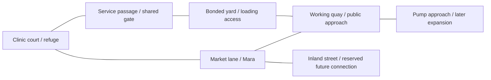

# Funstra development plan — A Port That Needs You

Creative Director proposal, 8 September 2026. [Epic #26](https://github.com/Kaliffen/Funstra/issues/26).
**Planning complete is not implementation or product-owner acceptance.** This is the single maintained roadmap and spatial design contract. GitHub issues own execution status. [VISION.md](VISION.md) owns the game promise; [WORLD.md](WORLD.md) owns setting facts. Start at [README.md](README.md) for the published game and documentation map.

## The decision

Preserve the warm, stylized isometric art. Rebuild Old Port as a place with useful spaces, owners, entrances, work and competing routes. Expand it in connected, distinct pieces. The player should learn a street, exploit its opportunities, depend on its people and eventually decide what it becomes.

The present executable is Demo 03, Keep the Lights On. It has a finite medical dispute, a support companion, a refuge represented outside, reactive dialogue, ambient traffic and optional legacy jobs/cargo. It does not have enterable rooms, a renewable physical supply chain, controllable squads or faction planning. Published evidence remains in [Evidence/VALIDATION.md](Evidence/VALIDATION.md); current play instructions are in [KEEP-THE-LIGHTS-ON.md](KEEP-THE-LIGHTS-ON.md). No future capability below is claimed for that build.

## What the feedback changes

| Input | CD disposition | Work |
|---|---|---|
| Owner/MVP feedback: good art, shallow and repetitive environment; needs scale and interactions | Accept. Spatial design becomes a core gameplay deliverable. Increasing ground area or prop count alone is insufficient. | Demo 04 and the spatial contract below |
| Priya/Nell: the refuge matters in prose more than in the world | Accept. Make recovery, shared space and eventually patient visits visible. | Existing [#22](https://github.com/Kaliffen/Funstra/issues/22), Demos 04–05 |
| Dag: finite economy is coherent, sustained traffic interaction remains uncertain | Keep the conserved rules, extend them to bounded imports and physical delivery; test obstruction before relying on travel for supply. | Existing [#23](https://github.com/Kaliffen/Funstra/issues/23), Demos 04–05 |
| Marcus: coverage limits and weak hardware evidence | Profile growth on the available 4090. Record actual CPU/GPU/memory costs; do not invent low-end support. | Existing [#21](https://github.com/Kaliffen/Funstra/issues/21), every release |
| Four Demo 03 scores of 8/10 | Preserve as guided-build judgments. They do not settle open-ended enjoyment or the long-term vision. | Every release has new identified-build reviews |
| Demo 03 reserve-threshold and standing screenshots | Already resolved in the publication addendum and closed #20. | Do not reopen as new work |
| Additional local field critique | Useful diagnosis of mission-shaped space and HUD density; source/still inspection has narrower coverage than live play. | Contextual HUD, physical work, autonomous baseline |
| Stop all development until unrestricted play or replace the entire art style | Decline. Continue the accepted guided-build process and seek owner/new-user reactions at published demos. Art should gain structure and purpose. | No art replacement programme or invented review requirement |

The [Demo 03 dossier](Docs/funstra-review-dossier-demo03.html) and original reviews remain historical records. The additional `Docs/funstra-field-review.html` is user-supplied, untracked input, not a new four-person dossier. Its older test counts and suggestion that no human has played are not adopted: the owner has already reported playing. This table is a new planning response, not a revision of anyone's score.

## Long-term target and the Demo 09 proof

**Become someone Old Port depends on.** The full game aspires to a damaged city where independently acting organizations need goods, labor, treatment and access; the player can survive outside them, join them or build one that can endure setbacks. The six-release arc proves this locally, before promising a citywide simulation.

By Demo 09, a player can begin dependent on shelter and a supplier, recruit two people, establish a staffed foothold and influence a dispute about the pump approach and relief access. At least three distinct connected subareas support the same resource and movement rules. Two local institutions respond to what they know and can afford.

The acceptance scenario is 60–90 minutes, with no required Mara job acceptance. Compare cooperation, illicit appropriation and deliberate non-intervention from comparable starting states. These must leave different visible staffing, access and treatment outcomes. Lose a route or refuge and recover through surviving relationships. After a local settlement, continue for three service cycles under the new obligations. Also demonstrate a viable independent livelihood without owning a building.

This is a proposed target for the product owner to judge. It is not a promise of six calendar weeks, a finished game, or a mandatory path from poverty to government.

## Six cumulative releases

| Release | Player power | Depends on | Ticket |
|---|---|---|---|
| 04 — Streets Worth Knowing | I know this neighborhood well enough to use it. | Published Demo 03 | [#27](https://github.com/Kaliffen/Funstra/issues/27) |
| 05 — Goods Have Somewhere to Go | I can keep a route working—or profit from its failure. | Demo 04 | [#28](https://github.com/Kaliffen/Funstra/issues/28) |
| 06 — Nobody Gets Home Alone | People and practiced skills let us survive what I could not. | Demo 05 | [#29](https://github.com/Kaliffen/Funstra/issues/29) |
| 07 — A Place of Our Own | Our work supports a place other people use. | Demo 06 | [#30](https://github.com/Kaliffen/Funstra/issues/30) |
| 08 — The Price of Order | What we control changes what institutions can demand. | Demo 07 | [#31](https://github.com/Kaliffen/Funstra/issues/31) |
| 09 — A Port That Needs You | The port negotiates with us, and we choose what to preserve. | Demo 08 | [#32](https://github.com/Kaliffen/Funstra/issues/32) |

The order is deliberate: space makes logistics meaningful; logistics gives the crew work; a working crew supports a foothold; institutions then have something real to contest. Demo 04 is ready for implementation scoping. Demos 05–09 are outcome plans whose details must respond to preceding evidence.

### Demo 04 — Streets Worth Knowing

**Outcome:** I know this neighborhood well enough to use it.

Recompose the existing Old Port around clinic court, market lane and service quay; add an adjoining working yard. Deliver a usable clinic/refuge room, a controllable yard gate, public and service entrances, shared collision/sight/navigation rules and contextual interaction cues. Move current activities to named locations with safe save migration. Existing #22 supplies the recovery moment; #23 covers prolonged blockage; #21 starts profiling.

**Acceptance:** Traverse two meaningfully different routes between clinic and quay: a public route exposed to observers and a service route dependent on gate access. Open/close the gate during a companion or resident journey; they reroute or explain waiting, never clip or teleport. Rest inside, interrupt safely, exit and reload with state intact. Demonstrate 20–30 minutes of play with before/after route screenshots and a legible normal HUD. Target 1.5–2 times baseline reachable walkable area, measured in the same navigation units; area alone cannot pass the release.

**Validation:** Exported controller routes through every new doorway/corner, pursuit/sight and companion regressions, door-blocked recovery, old save relocation preserving original save, prolonged traffic obstruction and clearing. Profile identical old/new routes on the 4090; set measured expansion budgets before adding further blocks.

**Limits:** No citywide expansion, general construction editor, procedural city generator, free driving or full daily-life simulation. Keep all existing clinic outcomes and cargo playable.

**Stop/replan:** If the new bounds demand a wholesale engine rewrite, first prove one room, one street loop and one reversible gate with bounded data; revise scope before adding districts.

Execution and release checkpoint: [#27](https://github.com/Kaliffen/Funstra/issues/27).

### Demo 05 — Goods Have Somewhere to Go

**Outcome:** I can keep a route working—or profit from its failure.

Connect quay store, a named carrier and clinic through a renewable medical shipment. Import goods through an explicit priced, finite-per-arrival source, with owner, destination and travel state. Show one named patient's visit/treatment/refusal. Schedules describe work and need, not arbitrary wandering. Offer paid work, purchase, diversion and theft using the same goods. Begin replacing cargo bank-trigger restock with deliveries; clearly bound any remaining legacy exceptions.

**Acceptance:** Observe at least three replenishment cycles without accepting a quest. Delay the carrier at the gate; clinic stock and visible treatment respond. Escort, purchase or divert the same shipment and show who gains/loses. A blocked path produces waiting, rerouting or cancellation with known cause. Log imports, inventories, consumption and exports so conservation closes; no doubled stock after save/reload.

**Validation:** Compare coarse/fine simulation steps, arrival and handoff reloads, interrupted carrier recovery, no-player baseline versus intervention, repeatability without money farming exploits; fresh rendered patient and delivery evidence.

**Limits:** One supply chain, one carrier and one patient role initially. No full commodity market, hunger meters, offline catch-up or infinite free import faucet.

**Stop/replan:** If a physical actor becomes a deadlock dependency, make delayed/cancelled service readable and recoverable before multiplying schedules.

Execution and release checkpoint: [#28](https://github.com/Kaliffen/Funstra/issues/28).

### Demo 06 — Nobody Gets Home Alone

**Outcome:** People and practiced skills let us survive what I could not.

Player plus up to two persistent recruits: retain Neri's medical role and introduce one dockworker/mechanic with wages, ties and a reason to join. Add selected-character control, tactical pause orders, role-specific work, shared carried supplies, carry/rescue and combat retreat/surrender. Deliver a small useful progression set for medicine, mechanics and combat/stealth through consequential actions, with transparent limits against repetitive farming.

**Acceptance:** Run a dock operation solo, with Neri, and with both recruits; demonstrate different solutions rather than only damage increases. Give a medic hold/aid orders and a worker gate/access work while the player distracts a guard. Rescue a downed person through the new geometry, or retreat and arrange their recovery. Supplies, injuries, promised pay and an objection survive reload. Staying solo remains supported.

**Validation:** Controller and AI use identical doors/cover; ordered actions cancel and resume honestly; no remote healing or duplicate carried actors; defeat/recovery with each active character; pause and migration regressions.

**Limits:** Three controllable people total; no large squads, detailed limb model, permadeath overhaul or dozens of skills. Squad architecture must grow from proven current support behavior.

**Stop/replan:** If switching actors destabilizes saves/orders, ship no larger roster until player plus Neri passes all control and rescue routes.

Execution and release checkpoint: [#29](https://github.com/Kaliffen/Funstra/issues/29).

### Demo 07 — A Place of Our Own

**Outcome:** Our work supports a place other people use.

Make the repaired refuge a staffed clinic/store foothold using existing supply, skills and recruits. Assign care, receiving and route work; wages, service income and supplies come from actual transactions. Allow a negotiated lease or coercive takeover with differing obligations. Make residents physically seek the service; denial and reliable care change individual willingness to help. Add a fallback shelter and a way to lose or relinquish the premises.

**Acceptance:** Operate three service cycles while the player is elsewhere; jobs consume real time/goods without simulating every decorative resident. Compare public service and crew reserve in visible visitors and cash. Fail a delivery/pay obligation, receive warning, then repair the relationship or lose access. Recover people and essential belongings through a fallback path. An independent worker can ignore ownership and earn a viable living.

**Validation:** Autonomous job conservation, wages, shortages, absence, assignment cancellation, save/reload mid-job, loss/recovery without softlocks; compare owner and independent play economics.

**Limits:** One manageable premises, a few assignable jobs, no city builder, passive income button or universal neighborhood approval meter.

**Stop/replan:** If upkeep becomes compulsory minute-by-minute clicking, simplify delegation before adding new buildings or resource types.

Execution and release checkpoint: [#30](https://github.com/Kaliffen/Funstra/issues/30).

### Demo 08 — The Price of Order

**Outcome:** What we control changes what institutions can demand.

Implement local Harbor Combine and Dock Mutual plans around the same route and services, with Compact enforcement as a bounded response. Plans require people, funds and known information. Add a visible checkpoint or work stoppage at the existing quay exit toward the pump approach; the approach itself opens in Demo 09, specific witness reports and delayed institutional response. Negotiate passage, share costs, expose a diversion, reroute, or use force. Define one authored dispute with several entry points.

**Acceptance:** Run a no-player baseline and two interventions from the same initial state; show different checkpoint staffing/access and service outcomes. Unseen theft causes missing-stock investigation without naming the player. A witnessed attack consumes response resources and creates a specific grievance. Settling money does not silently erase injury or every faction's knowledge. A lost deal leaves an actionable alternative route or settlement.

**Validation:** Knowledge provenance, bounded response resources, negotiation/violence consequences, blocked routes, actor incapacity, reload through plan transitions and fallback recovery.

**Limits:** Two active local faction planners, one limited enforcement response; no whole-city AI, elections, omniscient heat or endlessly spawning police.

**Stop/replan:** If outcomes require scripted invulnerability or stock resets to preserve the story, revise the situation to accept changed world state.

Execution and release checkpoint: [#31](https://github.com/Kaliffen/Funstra/issues/31).

### Demo 09 — A Port That Needs You

**Outcome:** The port negotiates with us, and we choose what to preserve.

Integrate the six-release systems around pump maintenance and a disputed relief contract. Extend the playable connection to a third distinct subarea at the pump approach. Existing imports, labor, treatment and access determine which local settlement is feasible. Author responses for service cooperation, illicit control and independent survival. Recognize a durable outcome while the sandbox continues under the resulting obligations.

**Acceptance:** Complete a 60–90 minute continuous scenario with no required Mara job acceptance. Exercise cooperation, illicit appropriation and deliberate non-intervention from comparable starts; get distinct visible access, staffing and treatment outcomes. Lose a supply route or refuge and recover through surviving people. Prove at least three connected subareas, player plus two recruits, staffed foothold and two local institutional plans. Continue for three service cycles after settlement with no world reset. Demonstrate a viable independent path.

**Validation:** End-to-end guided routes plus fresh four-lens reviews, machine-readable causal history, sustained simulation/performance profile, save migration and interrupted-session recovery. Gather owner/new-user unstructured impressions where available; guided reviews cannot certify open-ended enjoyment.

**Limits:** This is an Old Port sandbox milestone, not the finished city or game. No forced ending, mandatory faction victory, giant new map or unrelated feature expansion.

**Stop/replan:** If the integrated arc only works through quest flags or one optimal route, fix the shared dependency and defer spectacle rather than declare the sandbox complete.

Execution and release checkpoint: [#32](https://github.com/Kaliffen/Funstra/issues/32).

## Spatial design contract

### Geography with a reason

The prototype uses a roughly 96 × 96 paved footprint, repeated building masses, fixed boundaries and a 49 × 49 navigation grid at two-unit spacing (`CityArt.Build`, `CityNavigation`). A bigger scale constant will not create the intended city. Movement bounds, map projection, activity coordinates, navigation, saves and sight must be inspected together before expansion.

Retain the clinic, Mara, Vico and the quay as recognizable anchors, but recompose their surrounding blocks. Start with the following connected layout; this is topology, not a final metric map:

| Space | What makes it different | Decisions it supports | Changes to show |
|---|---|---|---|
| Clinic court | Small communal threshold, seats, visible care, room behind street frontage | Shelter, visiting, observation, protecting access | Occupied/empty bed, visitors, stock delivery, closed/public care |
| Market lane | Irregular shop fronts, stalls, public traffic and social visibility | Earn, buy, ask, distract, choose whether to be seen | Opening/access, witnesses leaving to report, altered trade |
| Service passage | Shorter confined route with sight breaks and controlled gate | Trade speed against permission, isolation and escape options | Gate position/access, waiting actor, changed route |
| Bonded yard | Loading apron, storage bays, long sightlines and two approaches | Observe, escort, steal, negotiate, ambush, retreat | Goods change location/owner, carrier arrives, guard posts respond |
| Pump approach | Raised dry access beside older floodworks, maintained by workers | Contest passage, defend work, bargain over institutional dependency | Work stoppage, staffed checkpoint, repaired access |

Demo 04 proves the court/market/quay loop and connected yard. Demo 09 reaches the pump approach as the third broader subarea: residential court/market, working quay/yard, and floodworks approach. The inland connection reserves expansion space; it does not pretend an unbuilt district is playable.

### Rules for useful space

- Each important destination has at least two useful approaches with different exposure, access or carrying constraints. Do not label an identical second corridor a meaningful choice.
- A door or gate declares who may open it, whether sight and shots pass, whether it is locked, and how player/NPC pathfinding responds. Demonstrate the same rule with the controller and an autonomous actor.
- Cover comes from geometry and sight, with bins retained as useful objects. Move away from a special green-object exception as shared cover is proven. Visual cover must not promise protection that combat ignores.
- Loading areas connect stored goods to work and onward travel. A carrier cannot invisibly deliver through a closed gate. Delays need readable causes and recovery; routes must not depend on permanent NPC invulnerability.
- Rooms have a gameplay purpose: rest, care, storage or negotiation. Begin with the refuge; no requirement to open every façade. Cutaways, selection and interaction reach must remain legible at normal camera height.
- Use irregular plot shapes, courtyards, narrow and broad passages, worn thresholds, loading equipment and visible repairs to distinguish places. Waterlines and pump hardware explain the world through material history.
- Vertical silhouettes can enrich the port immediately; traversable stairs, roofs and layered navigation wait for a bounded proof. Do not imply climbable scenery before traversal supports it.
- No empty acreage requirement. Initial 1.5–2× reachable-area target and eventual three subareas are subordinate to decisions, route timings and performance. Measure actual reachable space, not decorative water or inaccessible buildings.
- Place an observable activity, affordance or landmark along routine routes often enough that travel conveys useful information. Time clinic–quay public/service trips at normal movement; investigate long stretches with nothing to learn or do instead of tuning by map size alone.

### State and expansion foundations

Author named locations and stable IDs for entrances, stockpiles, work sites and actor homes. Keep presentation coordinates separate from story ownership. New modules connect at explicit street/access edges so future additions do not rewrite every mission position.

Give one authority to each door state, inventory transfer and actor assignment. Physics, navigation, interaction and rendered state read the same facts. Avoid building a generic simulation framework before one corridor and one delivery need it.

Extend bounds and navigation behind a small tested seam, keeping current gameplay functional. Use active nearby actors and bounded event updates for distant work if needed; transfers across that boundary must preserve IDs, goods and chronology. No streaming or multithreaded simulation mandate until profiling justifies it.

Each map revision needs an old-save relocation plan using stable location IDs and safe positions. Preserve original saves, relationships, goods and known consequences. If a migration cannot preserve an essential state, document the conflict before shipping; do not silently reset it.

### Readability and performance

The normal view should prioritize immediate action, danger and location. Put detailed ledgers and known schedules in inspection; visible appointments stay discoverable. The world should show the cause before the journal explains the accounting. Screenshots of clear menus alone cannot pass the environment gate.

On the only available 4090 machine, record CPU/GPU frame-time distributions, memory, allocations, actor/path counts, resolution and quality for a fixed route and a sustained busy scenario. Establish the Demo 03 baseline before map expansion; a >20% p95 frame-time or memory increase is an investigation trigger requiring attribution, not automatic evidence of failure or low-end support. Aim for a scalable 30 FPS low-quality experience, but name no supported minimum GPU until measured on it. Setting a frame cap only tests timing.

## Review, release and replanning gates

Each release owns implementation issues, a build identity, fresh exported-player evidence, four guided actual-build reviews, one consolidated dossier, CD disposition and affected-scenario replays. Publish only the tested artifact through [the pipeline](Docs/PIPELINE.md); verify website/downloads and retain exactly the latest five published releases, or all while fewer exist. Preserve original review files and old source tags.

Every panel gets a no-player baseline, a successful intervention and a failure/recovery route appropriate to that release. Include a rendered spatial route, not only staged UI. Dag judges alternatives and conservation; Priya visible people and institutional meaning; Marcus traversal, interruption and costs; Nell orientation, travel rhythm and returning home. They choose their own scores. Guided review is not unstructured human play.

Owner acceptance stays separate. At each published demo, compare the stated player outcome against evidence and user feedback, revise later tickets as needed, then stop for direction. This planning request does not start six autonomous build cycles.

Keep future detail in these six release tickets until its prerequisites are proven. Before Demo 04 implementation, split its map/access foundation from its inhabited refuge/readability work, reusing #21–23 for their existing concerns. Do not reopen completed Demo 03 fixes. If three attempts revisit the same blocker without new evidence, bring the concrete tradeoff to the owner.

## Documentation ownership

README is the entry point; VISION is the promise; WORLD is the setting; DESIGN is this plan; GitHub issues are execution status. [Docs/PIPELINE.md](Docs/PIPELINE.md) owns build/publication operations. Versioned guides, dossiers, validation and reviewer records describe particular builds and remain available as evidence. Historical documents are not competing instructions.

The root Demo 02/03 guides retain their package-compatible paths. Superseded mission/Hot Cargo prose is archived. Do not write another roadmap, process narrative or build-status report when updating its owner document suffices.
